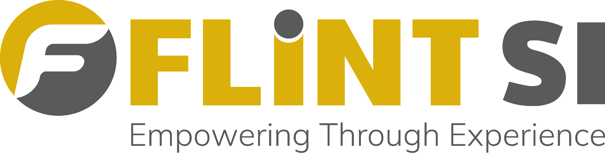
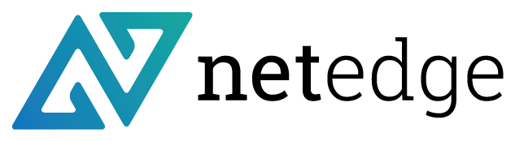

+++
title = "Partners"
weight = 2
description = "Organizations in the StratoWeave ecosystem."
+++

## Implementation partners

The following organizations can help you design, migrate, and operate
orchestration with StratoWeave.

<section aria-label="Current partners" style="display: grid; gap: 1rem;">
<article class="proof-card" style="grid-column: 1 / -1; max-width: 42rem; margin: 0 auto; width: 100%;">
<a href="https://www.intwine.net" target="_blank" rel="noreferrer" style="display: grid; gap: 0.85rem; color: inherit; text-decoration: none; justify-items: center; text-align: center;">

<strong style="font-size: 1.45rem;">Intwine</strong>
</a>
Intwine is the team behind StratoWeave. We help service providers build and maintain intent-based orchestration, without architectural lock-in.
</article>

<article class="proof-card">
<a href="https://flint.si" target="_blank" rel="noreferrer" style="display: grid; gap: 0.75rem; color: inherit; text-decoration: none;">

<strong>Flint SI</strong>
</a>
</article>

<article class="proof-card">
<a href="https://www.netedge.plus" target="_blank" rel="noreferrer" style="display: grid; gap: 0.75rem; color: inherit; text-decoration: none;">

<strong>NetEdge</strong>
</a>
</article>

<article class="proof-card">
<a href="mailto:k@centor.se" style="display: grid; gap: 0.75rem; color: inherit; text-decoration: none;">

Centor

<strong>Centor</strong>
</a>
</article>

</section>

If you are an integrator or consultancy working with service provider
customers, and you have expertise in orchestration strategy, migration,
service modeling, or production support, reach out to the maintainers to
discuss being listed as a partner.