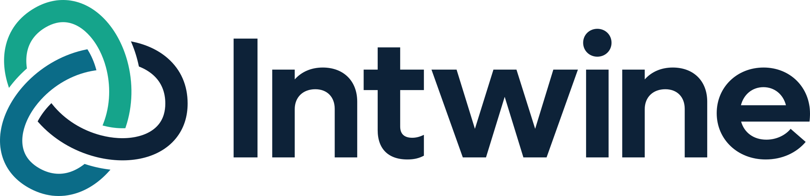
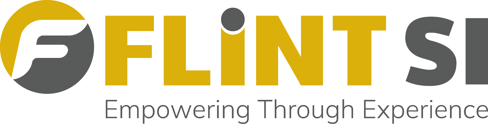

+++
title = "Partners"
template = "community.html"
weight = 2
+++

## Implementation partners

The following organizations can help you design, migrate, and operate
orchestration with StratoWeave.

<section class="partners-list" aria-label="Current partners">
<article class="partner partner--featured">
<a href="https://www.intwine.net" target="_blank" rel="noreferrer">

<strong>Intwine</strong>
</a>
Intwine is the team behind StratoWeave. We help service providers build and maintain intent-based orchestration, without architectural lock-in.
</article>

<article class="partner">
<a href="https://flint.si" target="_blank" rel="noreferrer">

<strong>Flint SI</strong>
</a>
</article>

<article class="partner">
<a href="https://www.netedge.plus" target="_blank" rel="noreferrer">

<strong>NetEdge</strong>
</a>
</article>

<article class="partner">
<a href="mailto:k@centor.se">

Centor

<strong>Centor</strong>
</a>
</article>

</section>

If you are an integrator or consultancy and you have expertise in orchestration strategy, migration,
service modeling, or production support, [reach out](mailto:info@stratoweave.org) to
discuss being listed as a partner.
